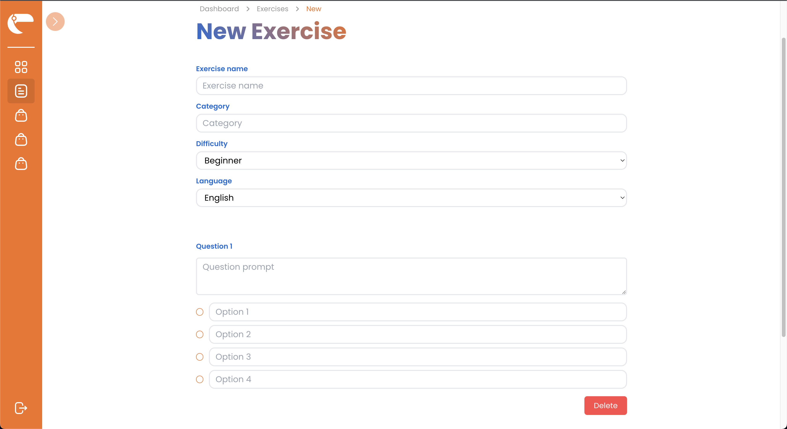
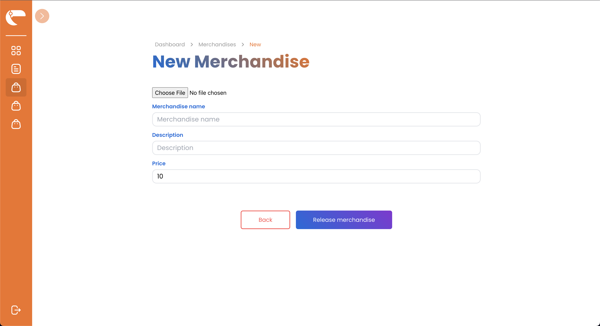
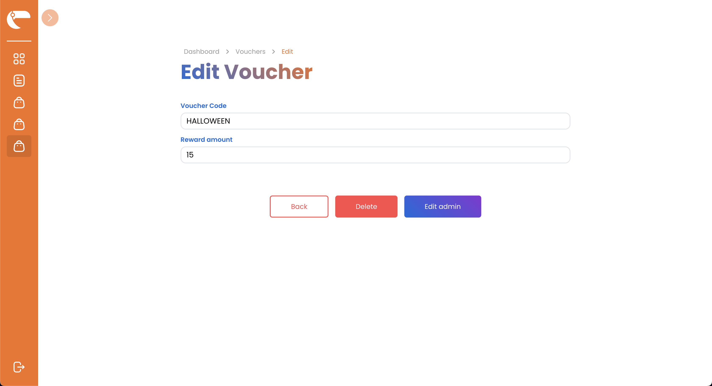
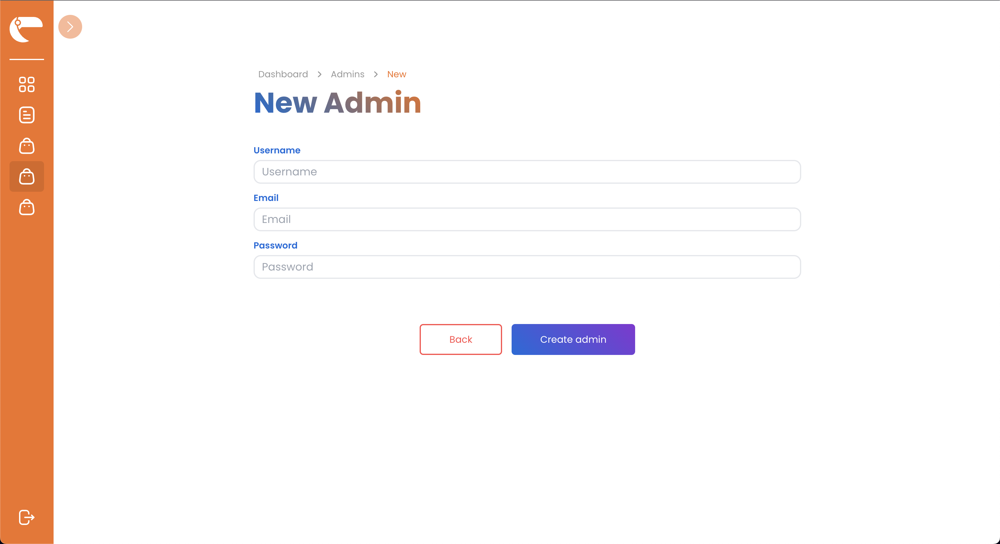

# SPA for Toco

## Introduction
Toco-SPA is a single page application for Toco that was built using react and tailwind. This service is built to complete IF3110 assignment.

## Features Overview
  - [x] responsive
  - [x] using tailwind css
  - [x] minimalistic

## Installation
using docker
- make sure you have docker installed
- run `docker compose build`
- run `docker compose up`
- the service will run on port 3000

## Screenshots
- login
 
- Exercise overview
  
- New exercise
  
- Edit exercise
  
- Merchandise overview
  
- New merchandise
  
- Edit merchandise
  
- Voucher overview
  
- New voucher
  
- Edit voucher
  
- Admin overview
  
- New admin
  
- Edit admin
  